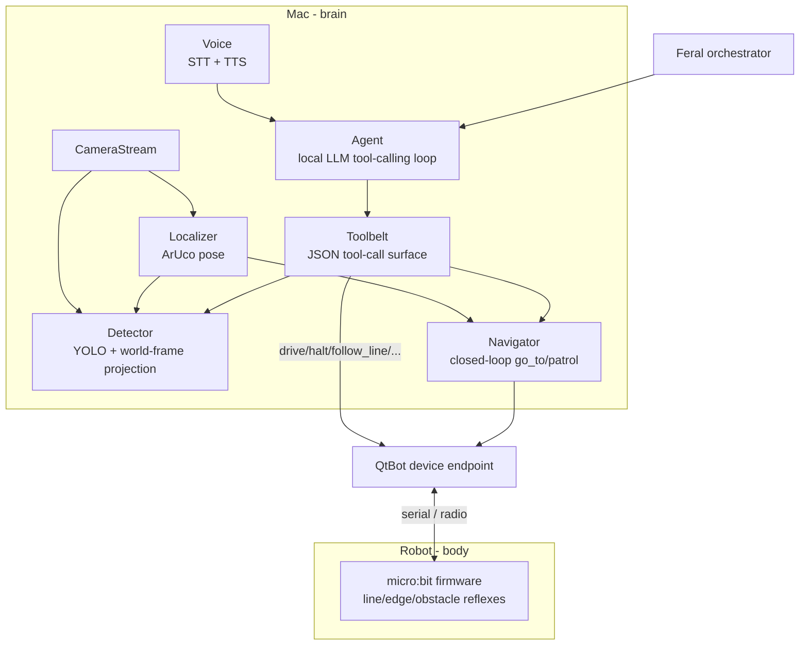

# `brain/` — local AI for the QtBot

The robot is the *body* (firmware: reflexes, serial, safety). This package
is the *brain*: everything that runs on the Mac and gives the QtBot
perception, language, and decision-making — all locally, no cloud.



Each layer is independently useful and can be tested standalone.

## One-call quickstart

```python
from brain import build_brain

stack = build_brain(camera=0)            # opens robot + camera + localizer + detector + agent
try:
    print(stack["agent"].run("explore the room and tell me what you see").text)
finally:
    stack["close"]()
```

`build_brain()` returns a dict with `robot`, `toolbelt`, `agent`,
`localizer`, `detector`, and `camera_stream`. The Feral orchestrator can
use any subset — call tools directly via `toolbelt.call("go_to", ...)` for
deterministic intent, or `agent.run("natural language")` for open-ended.

## Phase 1 - localization (you do this once)

1. **Calibrate the camera** with a printed chessboard
   (default: 9x6 inner corners at 2.4 cm).

   ```bash
   python -m brain.perception.localize calibrate --camera 0
   ```

   Press SPACE to capture ~20 well-distributed frames, ENTER to compute.
   Output: `brain/calib.json`.

2. **Print the markers** (DICT_4X4_50, IDs 0 + 1):

   ```bash
   python -m brain.perception.localize generate --size-cm 5
   # writes brain/markers/aruco_id{0,1}.png
   ```

   - ID 0 → tape flat on the **top of the robot**, marker +Y aligned with
     robot forward.
   - ID 1 → tape flat in the play area as the **world origin**.

3. **Verify pose**:

   ```bash
   python -m brain.perception.localize run --camera 0 --preview
   ```

   You should see live `(x_cm, y_cm, heading_deg)` printed and an OpenCV
   preview drawing axes on every detected marker.

## Phase 2 - closed-loop navigation

Once the localizer is publishing pose, the QtBot grows three new commands:

```python
from cutebot.device import QtBot
from brain.perception.localize import Localizer

bot = QtBot()
loc = Localizer(camera_index=0).start()
bot.attach_navigator(loc)

bot.go_to(40, 25)                              # blocking
bot.patrol([(0,0),(40,0),(40,40),(0,40)])      # cycle
bot.stop_navigation()
```

The navigator uses pure pose feedback and respects sonar (it pauses on
obstacles and aborts after `blocked_seconds` of continuous block). See
[`navigation.py`](navigation.py) for tunables.

## Phase 3 - vision

Run YOLO over the same camera frames and project detections to the world
floor plane:

```bash
# one-time CoreML export for ANE acceleration (optional)
python -m brain.perception.vision export-coreml

python -m brain.perception.vision run --camera 0 --preview
```

Each detection comes back with bbox, class, confidence, and `(x_cm, y_cm)`
when the world marker is visible. A motion gate skips inference on static
frames.

For open-ended scene questions, the optional VLM:

```bash
python -m brain.perception.vision describe "what's on the table?"
```

## Phase 4 - LLM tool-calling agent

Set your OpenAI key once and chat. Any model that supports the OpenAI
tool-call format works (`gpt-4o-mini`, `gpt-4o`, `gpt-4.1-mini`, etc.):

```bash
export OPENAI_API_KEY=sk-...
python -m brain.cognition.agent
you> patrol the four corners and stop if you see a person
agent> ...
```

Override defaults with `--model`, `--base-url`, or `--api-key`. To use a
local/self-hosted model server instead (Ollama, vLLM, OpenRouter, Azure
OpenAI), point `OPENAI_BASE_URL` at it — the protocol is identical:

```bash
export OPENAI_BASE_URL=http://localhost:11434/v1   # Ollama example
export OPENAI_MODEL=qwen2.5:7b
```

The agent only calls tools — it cannot drive motors any other way. Tools
match the Toolbelt manifest (`brain.tools.Toolbelt.manifest()`).

## Phase 5 - voice

```bash
python -m brain.perception.voice listen          # one-shot transcription
python -m brain.perception.voice loop            # press Enter, speak, agent acts
python -m brain.perception.voice say "hello"     # TTS smoke test
```

STT auto-detects the best installed backend: `parakeet-mlx` (Apple Neural
Engine) → `faster-whisper` fallback. TTS uses macOS `say` and is a no-op
on other platforms.

## Optional dependencies

The base repo (`requirements.txt`) stays lean (pyserial + uflash). Brain
extras live in [`requirements-brain.txt`](../requirements-brain.txt) so
you can pick what to install:

```bash
pip install -r requirements-brain.txt              # everything below
# or hand-pick:
pip install opencv-contrib-python numpy            # localize + navigate
pip install ultralytics                            # YOLO detector
pip install sounddevice parakeet-mlx               # voice (Apple Silicon)
pip install sounddevice faster-whisper             # voice (cross-platform)
pip install mlx-vlm                                # VLM scene description
```

The LLM agent talks to OpenAI directly over plain HTTP — no extra Python
package needed beyond the stdlib. Self-hosted alternatives (Ollama, vLLM,
OpenRouter, Azure OpenAI) plug in the same way: set `OPENAI_BASE_URL`.

## Coordinate conventions

- **World frame** is the world-marker's local frame: x right, y up,
  z out of the marker. Everything in cm.
- **Heading** in degrees, 0 = world +X, counter-clockwise positive.
- `drive(left, right) > 0` = forward; `drive(-s, +s)` = CCW spin
  (heading++).

## What stays unchanged

The firmware safety contract and the `QtBot` dict-based API. The brain
*adds* commands and perception; it never bypasses on-robot reflexes.
